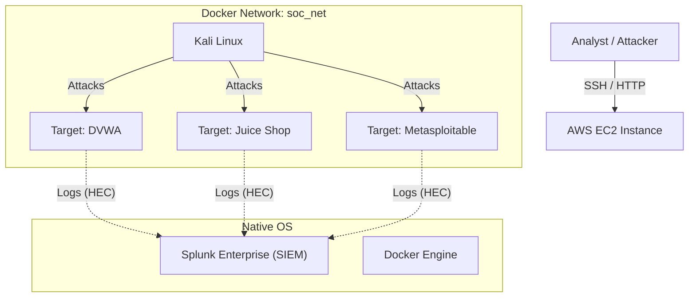

# 🛡️ AWS SOC Lab Project
### Cloud-Based Security Operations Center (SOC) Implementation

## 📖 Project Overview
This project involves the design, deployment, and operation of a fully functional Security Operations Center (SOC) within the AWS cloud. The lab simulates a real-world enterprise environment where a **SIEM (Splunk)** monitors, detects, and alerts on cyber attacks targeting vulnerable production assets.

**Objective:** To build a complete Red Team / Blue Team cycle—provisioning infrastructure, launching live attacks, and implementing detection signatures and automated response alerts.

## 🏗️ Architecture
The lab utilizes a **Hybrid Architecture** on an AWS EC2 instance:
*   **Host**: Ubuntu Server running **Splunk Enterprise** (Native Install) for persistence and performance.
*   **Docker Container Network**: Isolated network (`soc_net`) hosting:
    *   **Attacker**: Kali Linux (The "Red Team" machine).
    *   **Targets**: DVWA (Damn Vulnerable Web App), Mutillidae, and OWASP Juice Shop.



---

## 🛠️ Technologies Used
*   **Cloud Provider**: AWS (EC2, VPC, Security Groups, IAM).
*   **SIEM**: Splunk Enterprise (Native Linux Install).
*   **Containerization**: Docker & Docker Compose.
*   **Operating Systems**: Ubuntu Linux (Server), Kali Linux (Attacker).
*   **Log Ingestion**: Splunk HTTP Event Collector (HEC).
*   **Attack Tools**: Nmap, Hydra, Netcat, Python Scrips.

---

## ⚔️ Attack & Defense Showcase

### Scenario 1: Web Application Attack (SQL Injection)
*   **The Attack**: Exploited a vulnerability in DVWA using a magical string (`%' or '0'='0`) to bypass authentication and dump the entire user database.
*   **The Detection**: Written SPL (Splunk Processing Language) to identify suspicious URL patterns.
    *   *Signature*: `index=soc_lab "%" OR "UNION" OR "1=1"`

### Scenario 2: Infrastructure Hacking (Brute Force)
*   **The Attack**: Used **Hydra** from the Kali container to brute-force the FTP password of the Metasploitable server.
*   **The Detection**: Identified a spike in failed login attempts followed by a successful session.
    *   *Alert*: Created a "High Severity" alarm triggering on >20 failed attempts in 1 minute.
    *   *Signature*: `index=soc_lab "ftp" AND "failed"`

### Scenario 3: Remote Exploitation (Reverse Shell)
*   **The Attack**: Executed a Command Injection attack on DVWA to force the server to initiate a connection back to the attacker (Kali), granting full control (`www-data` shell).
    *   *Technique*: Used `nc` listener and a Python payload to bypass local walls.
*   **The Detection**: Correlated network traffic on non-standard ports (4444) with process execution logs.
    *   *Alert*: "Critical" Real-Time Alert for shell execution signatures.
    *   *Signature*: `index=soc_lab "nc -e" OR "/bin/sh" OR "dev/tcp"`

---

## 🚀 How to Replicate
1.  **Provision AWS**: Launch an Ubuntu EC2 (`t3.large`).
2.  **Install Splunk**: SCP the `.deb` file and install via `dpkg`. enable HEC.
3.  **Deploy Containers**:
    ```bash
    bash hybrid_setup.sh
    ```
    *(Script automates the deployment of Kali and Targets with Splunk Logging drivers)*.
4.  **Simulate Attacks**: Follow the guides in `docs/attacks/`.

## 📈 Future Improvements
*   Implement **Splunk SOAR** for automated IP blocking.
*   Integrate **Suricata/Snort** for IDS (Intrusion Detection) logs.
*   Map all alerts to the **MITRE ATT&CK Framework**.

---
*Created by Pradip Pandey*
